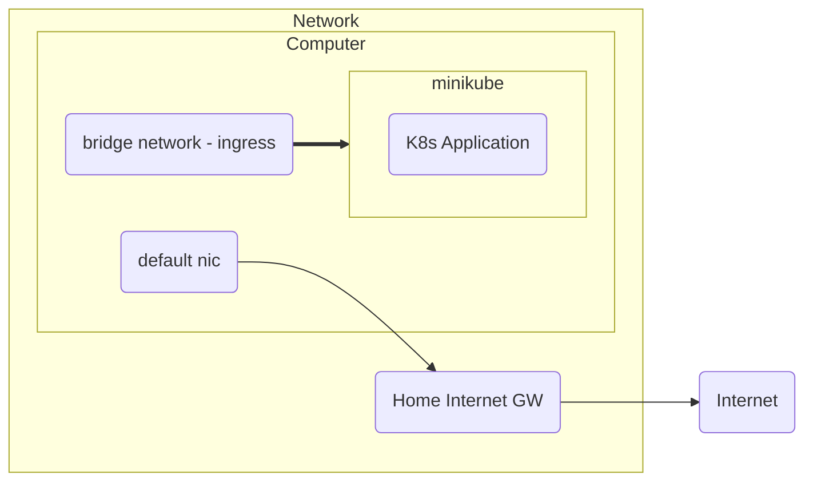
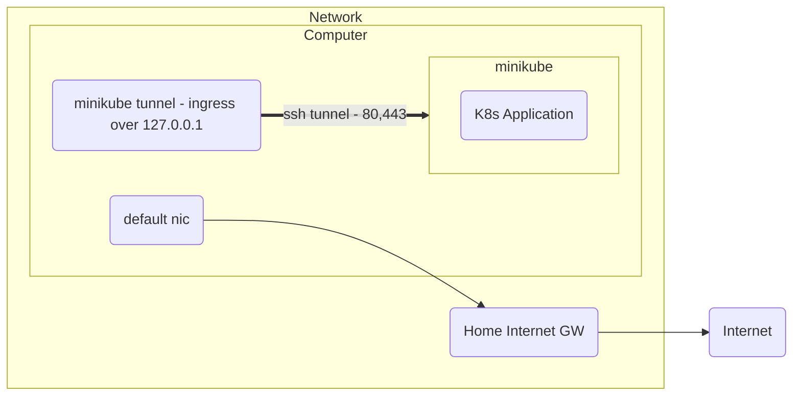

# Notes
Before you begin, it is important to know the architecture what minikube brings on different platform


## Linux

### Architecture

#### Ingress
When you install docker-community, you will get a docker0 and br-xxxxxx interface as shown in the example

```
→ ip a
1: lo: <LOOPBACK,UP,LOWER_UP> mtu 65536 qdisc noqueue state UNKNOWN group default qlen 1000
    link/loopback 00:00:00:00:00:00 brd 00:00:00:00:00:00
    inet 127.0.0.1/8 scope host lo
       valid_lft forever preferred_lft forever
    inet6 ::1/128 scope host noprefixroute
       valid_lft forever preferred_lft forever
...
5: docker0: <NO-CARRIER,BROADCAST,MULTICAST,UP> mtu 1500 qdisc noqueue state DOWN group default
    link/ether 02:42:9e:c1:69:df brd ff:ff:ff:ff:ff:ff
    inet 172.17.0.1/16 brd 172.17.255.255 scope global docker0
       valid_lft forever preferred_lft forever
    inet6 fe80::42:9eff:fec1:69df/64 scope link
       valid_lft forever preferred_lft forever
56: br-9bf45b7ae888: <BROADCAST,MULTICAST,UP,LOWER_UP> mtu 1500 qdisc noqueue state UP group default
    link/ether 02:42:7b:05:03:4f brd ff:ff:ff:ff:ff:ff
    inet 192.168.49.1/24 brd 192.168.49.255 scope global br-9bf45b7ae888
       valid_lft forever preferred_lft forever
    inet6 fe80::42:7bff:fe05:34f/64 scope link
       valid_lft forever preferred_lft forever
...
```

> By default, for linux we use the bridge interface (e.g. `56: br-9bf45b7ae888`) for the nginx ingress add from minikube.

Therefore in the `setup.config`, the DOMAIN flag, sets argocd and some other tools (TBA), to use this ingress. We use `nip.io` to save the hassle of DNS
provisioning here. 

```
# Local Domain
# -----------
# Replace This with a working DNS domain if you want e.g. example.com
DOMAIN=127-0-0-1.nip.io
```
*Example: of a Domain that point to 127.0.0.1*


Therefore if we want to access this we should change the DOMAIN with the minikube's IP
```
→ minikube ip
192.168.49.2
```
So we get
```
DOMAIN=192-168-49-2.nip.io
```
or
```
DOMAIN=192.168.491.2.nip.io
```

This thus forwards traffic via the Bridge Interface on you local machine. 

Therefore, assuming you want to access argocd,  enter http://argocd.192-168-49-2.nip.io on your browser.

### Visual Diagram



### Limitations

As shown in the previous diagram, the minikube you setup has to mean to reach beyond the boundaries of you local machine networks, e.g. home network or internet. 
To do there, you can use iptables to forward traffic from your default nic to your bridge interface. 

## Microsoft Windows 

For WSL folks like me, this is a bit of hassle and unfortunate, as there are more work to do.

### Visual Diagram



### To access ingress with WSL

From the above diagram, it looks pretty similar for linux. However, there are alot of manual steps, that cannot be automated by the scripts. 

1. The bridge interface does not exist in windows therefore you need to run `minikube tunnel` manually, to create a forwarding tunnel to  `127.0.0.1` port `80` and `443` respectively. You also need to patch the Nginx ingress (which is already automated by the scripts by OS Detection). 

2. Once, you trigger `minikube tunnel` you are expected to input your password for `sudo`, otherwise the tunnel won't work. 

This is a manual process, until there is a better solution or there are bridge interface capabilities for Windows, for now, accessing ingress is a manual process.
